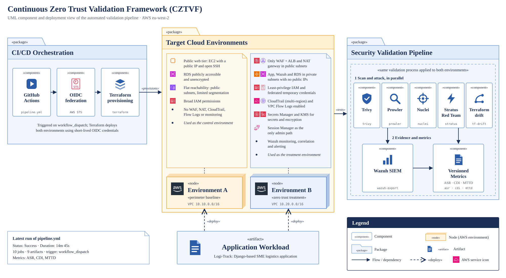

# Zero Trust vs Perimeter — Automated Pentest Evaluation Environment




*Figure: UML component and deployment view of the Continuous Zero Trust Validation Framework (CZTVF) in AWS eu-west-2.*

A GitHub Actions workflow (`pipeline.yml`) authenticates to AWS through OIDC federation, so it uses short-lived STS credentials and stores no access keys. Terraform then provisions two environments running the same Logi-Track Django workload:

- **Environment A (perimeter baseline):** a public EC2 tier with open SSH, a publicly accessible and unencrypted RDS database, flat networking, broad IAM permissions and no WAF or logging.
- **Environment B (zero trust treatment):** only the WAF, ALB and NAT gateway are public. The application, Wazuh and RDS sit in private subnets. It adds least-privilege IAM with temporary credentials, multi-region CloudTrail, VPC Flow Logs, Secrets Manager with KMS, Session Manager as the only admin path, and Wazuh monitoring.

Both environments go through the same validation process. Trivy, Prowler, Nuclei, Stratus Red Team and a Terraform drift check run in parallel. Their findings flow into Wazuh and are exported as versioned metrics (ASR, CDI and MTTD), so each run can be compared directly between the two environments.

# Technical environment for the MSc dissertation:
**"Evaluating the Effectiveness of Zero Trust Security Controls Through Automated Penetration Testing in a Cloud-Based SME Environment."**

Two AWS environments host the same Django app (**Logi-Track**) and are attacked by an
identical automated pipeline. The difference in outcomes quantifies the effectiveness of
Zero Trust controls.

| | Environment A | Environment B |
|---|---|---|
| Model | Perimeter / baseline | Zero Trust |
| Network | Flat, public subnets, open SGs | Private subnets, SG-to-SG micro-segmentation, VPC endpoints, deny NACLs |
| Identity | Broad IAM, SSH key access | Scoped IAM, no wildcards, SSM Session Manager |
| Ingress | App exposed directly | ALB + WAF, identity-aware edge auth |
| Data | Plaintext env vars, defaults | KMS + Secrets Manager, TLS in transit |

## Architecture

- **Compute:** EC2 (Django, behind an ALB) + **RDS** (PostgreSQL)
- **IaC:** Terraform, shared parameterised modules toggled by a `zero_trust` flag so A and B
  differ **only by configuration** (a controlled-variable comparison)
- **State:** S3 backend + DynamoDB lock, single AWS account
- **Monitoring:** Wazuh SIEM
- **Attack pipeline (GitHub Actions, 5 stages):**
  1. **Terraform** — provision / validate
  2. **Trivy** — IaC & container vulnerability scanning
  3. **Prowler** — AWS security posture assessment
  4. **Nuclei** — web/app vulnerability scanning
  5. **Stratus Red Team** — cloud adversary emulation

## Evaluation metrics

| Code | Metric | Meaning |
|---|---|---|
| ASR  | Attack Success Rate | Fraction of attack techniques that succeeded |
| LMCS | Lateral Movement Capability Score | `(Σ V_i·W_i)/K_max` — higher = more lateral movement = weaker containment |
| MTTD | Mean Time To Detect | Avg time from attack action to Wazuh detection (detected actions only) |
| CBCS | CIS Benchmark Compliance Score | `(C_passed/(C_total−C_ignored))×100` from Prowler vs CIS AWS Foundations |
| CDI  | Configuration Drift Index | `1 − (CBCS_current/CBCS_baseline)` — configuration drift over time |

> Full definitions and formulae in `docs/metrics.md`.

## Repository layout

```
.
├── app/logi-track/            # Django application (source + Dockerfile)
├── terraform/
│   ├── bootstrap/             # one-time: S3 state bucket + DynamoDB lock table
│   ├── modules/               # shared, parameterised modules
│   │   ├── networking/        # VPC, subnets, IGW/NAT, routes, VPC endpoints
│   │   ├── security/          # security groups + NACLs
│   │   ├── iam/               # instance roles/profiles
│   │   ├── kms/               # KMS keys
│   │   ├── secrets/           # Secrets Manager
│   │   ├── database/          # RDS PostgreSQL
│   │   ├── compute/           # EC2/ALB, Django user-data
│   │   ├── edge/              # WAFv2 + optional Cognito OIDC (Env B ingress)
│   │   └── wazuh/             # Wazuh SIEM host
│   └── environments/
│       ├── environment-a/     # perimeter baseline
│       └── environment-b/     # zero trust
├── .github/workflows/         # 5-stage attack pipeline
├── security/                  # tool configs (trivy, prowler, nuclei, stratus)
├── wazuh/                     # SIEM stack, custom rules/decoders
├── metrics/                   # metric collection + analysis (ASR/LMCS/MTTD/CBCS/CDI)
└── docs/                      # design notes, metric definitions, runbook
```

## Getting started

```bash
# 1. Bootstrap remote state (one time)
cd terraform/bootstrap && terraform init && terraform apply

# 2. Provision Environment A
cd ../environments/environment-a && terraform init && terraform apply
```

See `docs/runbook.md` for the full workflow.
